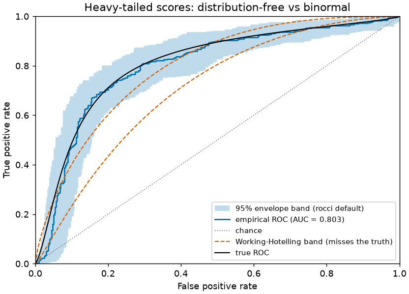

# rocci

**Distribution-free simultaneous confidence bands for ROC curves.**



A ROC curve computed from finite data is an estimate, and it is common to draw
it with no uncertainty at all. `rocci` puts a **simultaneous confidence band**
around it: a region that contains the *entire* true population ROC curve with
the confidence you ask for — not just each point one at a time.

```python
from rocci import roc_band

band = roc_band(y_true, y_score)   # labels + scores, any common container
band.plot()
print(band.summary())
```

That is the whole quickstart. See it annotated in
[Getting started](getting-started/quickstart.md), or run the
[scikit-learn vignette](vignettes/01-quickstart-sklearn.md) end to end.

## Why rocci

- **Correct by default.** The default band is a studentized bootstrap
  envelope with exact small-sample floors — distribution-free,
  [validated in a 2.25M-evaluation simulation study](method/simulations.md)
  across Gaussian, heavy-tailed, skewed, and multimodal score distributions,
  and honest where no distribution-free bound exists. No normality
  assumption; heavy ties and discrete scores are safe (conservative, and
  tested).
- **Just works.** NumPy arrays, pandas/polars Series, torch/JAX tensors,
  Python lists, `(n, 2)` probability matrices, posterior draws — ingestion is
  duck-typed with zero hard dependencies on any of those libraries.
- **Drop-in.** `from_estimator(clf, X, y)` mirrors scikit-learn's
  `RocCurveDisplay.from_estimator`; `band.auc` is exactly
  `sklearn.roc_auc_score`; `band.to_dataframe()` hands the band to pandas.
- **Fast.** The bootstrap kernel is compiled Rust (a pure-NumPy fallback keeps
  the package working everywhere): 2 000 bootstrap replicates on 100 000
  samples in well under half a second.
- **Lightweight.** Runtime dependencies are `numpy` and `scipy` — nothing
  else. Plotting is an optional extra (`rocci[plot]`).

If you are comfortable assuming binormal scores, `normal=True` gives the
tighter parametric **Working–Hotelling** band — and rocci runs normality
diagnostics and warns loudly when that assumption looks doubtful, as in the
figure above, where the true curve escapes the parametric band entirely.
[Which band should I use?](guide/which-band.md) explains the trade.

## Where to next

- [Installation](getting-started/installation.md) — `pip install rocci`;
  binary wheels for all mainstream platforms.
- [Reading the band](guide/reading-the-band.md) — what "simultaneous" buys
  you, and what the vacuous region at tiny FPR means.
- [The envelope method](method/envelope.md) — how the band is built.
- [Simulations and validation](method/simulations.md) — the evidence that the
  method works where the classical bands fail.
- [How rocci is verified](method/verification.md) — the case for trusting the
  numbers.
- [API reference](api.md) — the full public surface (it's small).

## Citing

If rocci contributes to a publication, please cite it — see
[`CITATION.cff`](https://github.com/ndelaneybusch/rocci/blob/main/CITATION.cff)
in the repository. `band.summary()` ends with the same pointer.
